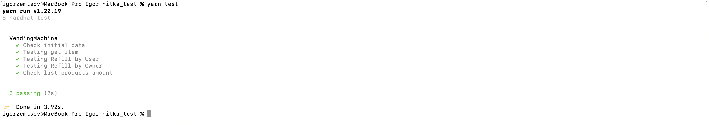
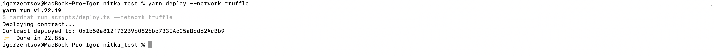
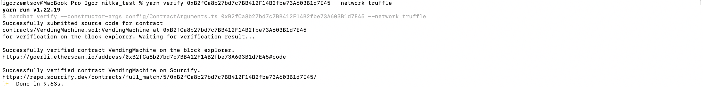
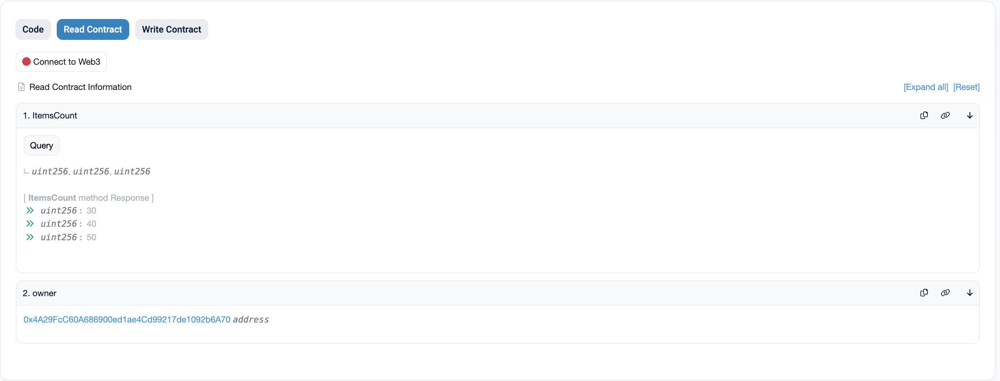
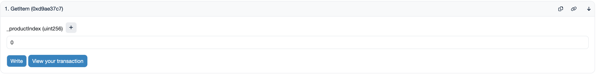
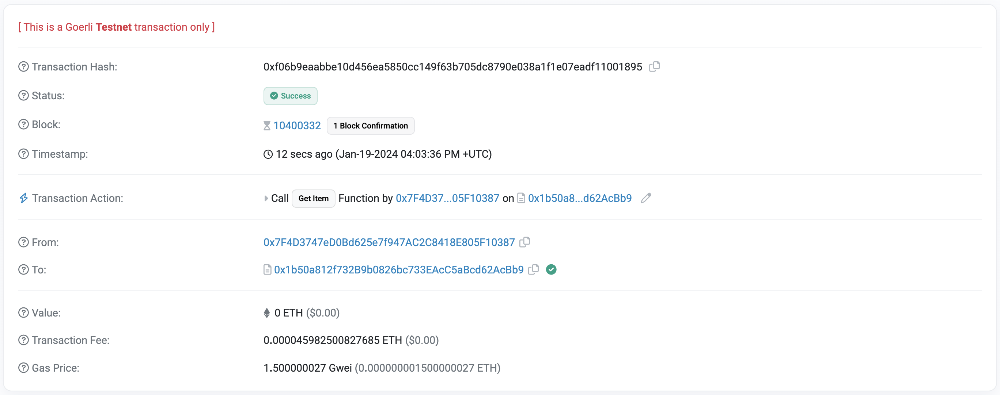
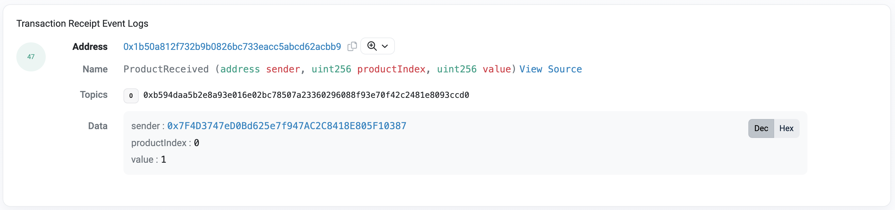
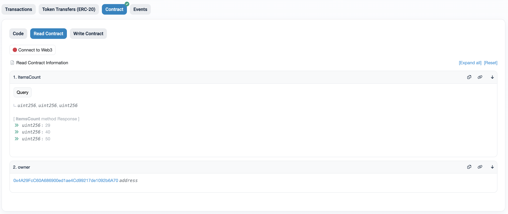
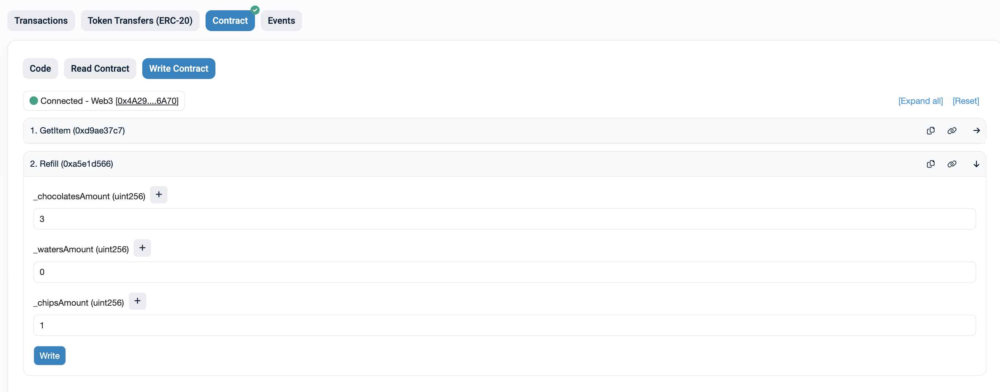
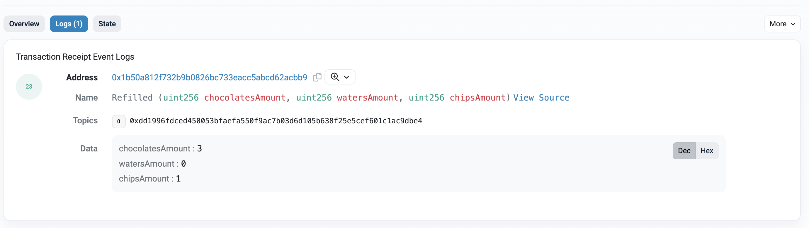

# Vending Machine

v0

## Overview

This project demonstrates the simplest capabilities of a vending machine.

## Requirements
- NPM 20.x and higher
- Truffle 5.x

## Installation
```
git clone https://github.com/ZemtsovIgor/vending_machine
cd vending_machine
npm install
```

## Running Unit tests
```
npm run test
```
As a result of executing this command, a unit test is launched


## Deploying contract
```
truffle dashboard
npm run deploy --network truffle  
```
As a result of executing this command, the deployment of the contract to the selected EVM in the traffle is launched and the execution result will be something like this:


After which you should verify the contract with the following command where the `CONTRACT_ADDRESS` is the address of the newly deployed contract
```
yarn verify CONTRACT_ADDRESS --network truffle
```


You can check the result of your deployment using the explorer like that:


[GOERLY Example](https://goerli.etherscan.io/address/0x1b50a812f732B9b0826bc733EAcC5aBcd62AcBb9#code)

## Testing contract

First we will get the Product from our vending machine:




The logs show the successful completion of the transaction:



Let's check the quantity:


Now let's check the replenishment of the vending machine:


The logs show the successful completion of the transaction:

